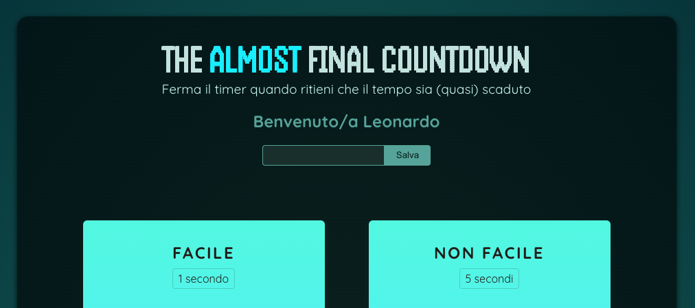

# The Almost Final Countdown ⏱️

**The Almost Final Countdown** è un gioco sviluppato in React che mette alla prova la percezione del tempo del giocatore.



Il giocatore inserisce il proprio nome, sceglie un livello di difficoltà, e fa partire un timer **invisibile**. Quando pensa che il tempo sia quasi scaduto, preme il pulsante per fermarlo. Più si avvicina allo scadere del tempo reale, maggiore sarà il punteggio.

## Tecnologie utilizzate

- React
- useState
- useRef
- React Portal

## Installazione

Per eseguire il progetto in locale:

```bash
git clone https://github.com/tuo-username/the-almost-final-countdown.git
cd the-almost-final-countdown
npm install
npm run dev
```

## Autore

Creato da Leonardo Loddo, Web dev e Docente di sviluppo.
